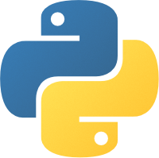
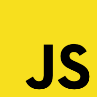
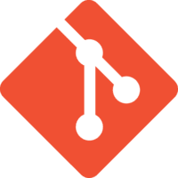
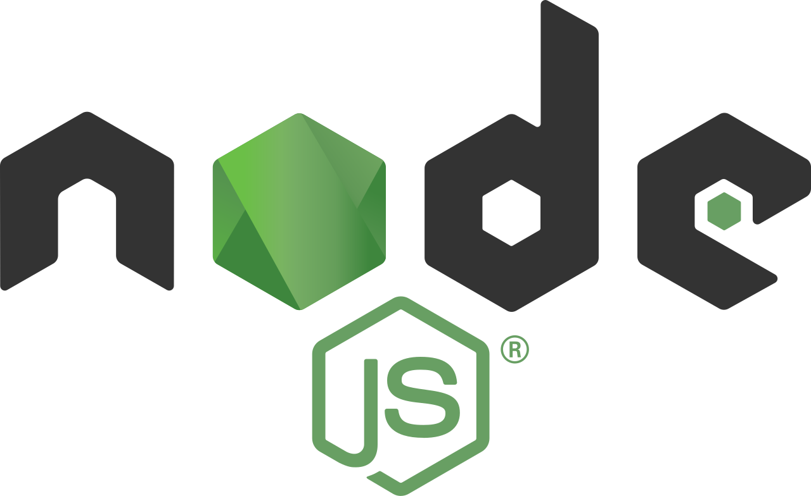

# Hello there 👋

<!--
**MattSo28/mattso28** is a ✨ _special_ ✨ repository because its `README.md` (this file) appears on your GitHub profile.

Here are some ideas to get you started:

- 🔭 I’m currently working on ...
- 🌱 I’m currently learning ...
- 👯 I’m looking to collaborate on ...
- 🤔 I’m looking for help with ...
- 💬 Ask me about ...
- 📫 How to reach me: ...
- 😄 Pronouns: ...
- ⚡ Fun fact: ...
-->

**About me**

I'm still working on updating this profile~

I'm a Cloud Integration Engineer by profession, mechanical engineer by training. I have experience as an application integration developer. 
 
Currently expanding my knowledge in full stack development, data engineering, and cloud infrastructure.

## Skills

### What I'm working with

#### Languages and Web Frameworks

[

]: #

#### Tools and Platforms

[

]: #

### What I'm learning

#### Languages and Web Frameworks

[

]: #

#### Tools and Platforms

[

]: #

### Other Tools

